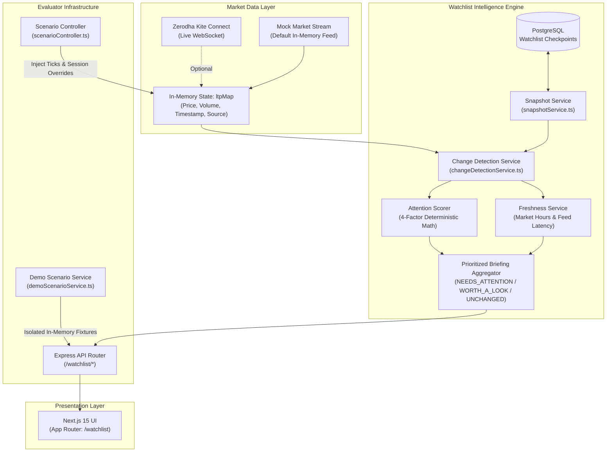

# smart-market-watchlist

> **Know what changed while you were away — and why it matters.**

An engineering submission for the **Code, by Groww 2026** challenge (*Theme: Build a Smart Market Watchlist*).

*Note: This project is an independent hackathon submission and is not an official Groww product, nor is it affiliated with Groww.*

---

## 100-Word Product Pitch

Smart Market Watchlist transforms passive stock tracking into an intelligent market briefing for Indian equities. While conventional watchlists display static current prices, our engine preserves timestamped user checkpoints to detect what meaningfully changed while you were away. Upon returning, an in-memory change detection engine evaluates price swings, volume anomalies, benchmark alpha against NIFTY 50, and corporate catalysts using a deterministic four-factor attention scoring model. Combined with an intelligent market freshness evaluator that clearly distinguishes closed trading sessions from stale feeds, the system delivers ranked, explainable stock briefings with zero broker dependencies through a dual-mode live or mock market data architecture.

---

## The Primary Product Story

### The Problem with Conventional Watchlists
Conventional market watchlists display only the **current market snapshot** (current LTP, day's high/low, and daily percentage change from previous close). If a user steps away for two hours and returns, a display showing `+0.4% today` conceals the actual story: did the stock drop 3% on high volume and recover? Did it diverge sharply from NIFTY 50? Did a major regulatory catalyst break while they were away?

### The Smart Watchlist Solution
Smart Market Watchlist introduces **stateful observation checkpoints**. It remembers exactly when the user last acknowledged their watchlist and computes the precise delta that accumulated during their absence.

Rather than flooding the user with raw ticks or arbitrary alert noise, it executes a deterministic pipeline:

```text
Current market state
        ↓
User checkpoint (last visit)
        ↓
Delta detection (ΔPrice, Volume Pace, Benchmark Alpha, New Catalysts)
        ↓
Attention scoring (0 - 100 deterministic multi-factor model)
        ↓
Deterministic reasons (Factual, human-readable explanations)
        ↓
Prioritized watchlist briefing (NEEDS ATTENTION → WORTH A LOOK → UNCHANGED)
```

---

## Meaningful Change Model

The repository implements a mathematical, deterministic attention scoring model (`attentionService.ts`) that maps multi-dimensional delta observations into a single score bounded between `0` and `100`:

$$\text{Attention Score} = \text{round}\Big((40 \times \text{PriceFactor}) + (25 \times \text{VolumeFactor}) + (20 \times \text{BenchmarkAlpha}) + (15 \times \text{CatalystCount})\Big)$$

### Factor Breakdown & Normalization Logic

| Factor | Weight | Formula in Code | Description & Saturation Behavior |
| :--- | :---: | :--- | :--- |
| **Price Factor** | 40% | `min(1.0, |ΔP%| / 5.0)` | Normalized price change since the checkpoint. A 5.0% price swing reaches the maximum factor value of 1.0 (40 points). |
| **Volume Factor** | 25% | `min(1.0, max(0, volumeRatio - 1.0) / 2.0)` | Volume pace ratio (`currentVolume / checkpointVolume`). Activates only when volume exceeds baseline pace (`volumeRatio > 1.0`); a 3.0x volume pace reaches 1.0 (25 points). Returns 0 if checkpoint baseline is unavailable. |
| **Benchmark Alpha** | 20% | `min(1.0, |stockΔP% - NIFTY50ΔP%| / 4.0)` | Relative performance divergence against the NIFTY 50 index since the checkpoint. A 4.0% relative divergence reaches 1.0 (20 points). Handled gracefully as `null` if the benchmark quote is missing. |
| **Catalyst Count** | 15% | `min(1.0, newEventCount / 2.0)` | Number of new corporate actions, earnings releases, or macro news events ingested since the checkpoint. ≥ 2 new events reach 1.0 (15 points). |

### Significance Categorization Tiers

Items are segmented into three priority tiers based on composite scores and boundary override conditions:

1. **`NEEDS_ATTENTION`**:
   - Condition: `attentionScore >= 60` **OR** `|ΔP%| >= 2.5%` **OR** `newEventCount >= 2`
   - Purpose: Stocks experiencing major directional moves, sudden institutional volume surges, or critical corporate developments.
2. **`WORTH_A_LOOK`**:
   - Condition: `attentionScore >= 30` **OR** `|ΔP%| >= 1.0%`
   - Purpose: Moderate price drifts or notable benchmark divergences that warrant secondary review.
3. **`UNCHANGED`**:
   - Condition: Does not meet `NEEDS_ATTENTION` or `WORTH_A_LOOK` criteria.
   - Purpose: Normal market noise (e.g., fluctuations < 1.0% with steady volume), presented compactly without alert fatigue.

### Factual Explanations & Alert Continuity
- **Deterministic Reasons:** Every evaluated item receives structured, category-tagged reasons (`PRICE`, `VOLUME`, `BENCHMARK`, `CATALYST`) explaining why it ranked where it did (e.g., *"Price moved +4.50% since last check"*, *"Volume pace is 2.8× since checkpoint"*, *"Outperformed NIFTY 50 by +3.50%"*).
- **Event Continuity Key (`computeEventContinuityKey`):** A stable signature hashing the symbol, significance tier, rounded price bucket, and event count. Minor incremental price ticks (e.g. +2.80% to +2.82%) do not trigger false alert state changes or re-render churn.

---

## Persistence & Checkpoints

Checkpoints persist user state across browser sessions and devices using PostgreSQL via Prisma (`snapshotService.ts`):

- **First Visit Baseline:** When a user accesses the watchlist for the first time without an existing checkpoint record, the system snapshots current prices and volumes, creates an initial baseline, and returns `isFirstVisit: true`. All items display initial baseline prices with `0.00%` delta and `UNCHANGED` status to prevent false notifications.
- **Subsequent Return Visits:** On return visits, the backend loads the user's stored checkpoint from the `WatchlistCheckpoint` and `WatchlistCheckpointItem` tables, computes the delta between current market quotes and checkpoint values, and calculates the elapsed duration (e.g., *"2h 17m ago"*).
- **"Mark All as Checked":** Triggered via `POST /watchlist/checkpoint`. The backend executes an atomic Prisma transaction that updates `WatchlistCheckpoint.lastCheckedAt` to `now()` and replaces previous `WatchlistCheckpointItem` records with latest observed market prices and volumes.
- **Strict User Isolation:** Checkpoints are scoped directly to the authenticated user ID (`userId` decoded from verified JWT credentials). One user's actions or demo executions never leak to or mutate another user's baseline.

---

## Market Freshness & Data Quality

The freshness engine (`freshnessService.ts`) continuously monitors data timestamps and exchange session state:

| State | Condition | Evaluator Confidence | Behavior |
| :--- | :--- | :---: | :--- |
| **`LIVE`** | Active session (09:15–15:30 IST), quote age ≤ 5s | Confident (`true`) | Real-time streaming ticks active. |
| **`DELAYED`** | Active session, quote age between 5s and 30s | Confident (`true`) | Minor feed latency detected. |
| **`STALE`** | Active session, quote age > 30s | Degraded (`false`) | Stream dropped or interrupted during live trading hours; warning displayed. |
| **`MARKET_CLOSED`** | Outside NSE trading hours or weekend | Confident (`true`) | Official exchange closing prices; fully trustworthy for delta analysis. |
| **`DATA_UNAVAILABLE`**| Active session, but zero ticker feeds discoverable | Degraded (`false`) | Feed disconnected; evaluation suspended. |

### Critical Architectural Principle: `MARKET_CLOSED != STALE`
A closed exchange session is **not** stale data. On weekends or after trading hours (15:30 IST), closing prices remain static and fully valid. The system evaluates `MARKET_CLOSED` with high confidence (`canEvaluateConfidently: true`). Conversely, market-open status alone does not guarantee a live feed: if exchange hours are active but quotes stop arriving, the engine detects the gap and flags the feed as `STALE`.

---

## Market Data Architecture

The application implements a dual-source market data architecture that normalizes quotes before they reach watchlist intelligence services:

```text
Real Zerodha Kite Ticker (WebSocket) ──┐
                                       ├──► In-Memory State: ltpMap ──► Watchlist Core Services
High-Fidelity Mock Stream (Default) ──┘    (Price, Volume, Timestamp)
```

1. **In-Memory LTP Map (`portfolioService.ts`):** Serves as the normalized internal single source of truth for instrument quotes. Watchlist services consume this map directly without coupling to any specific broker library.
2. **High-Fidelity Mock Stream (`kiteMockStream.ts`):** The default operational mode (`MARKET_DATA_MODE=mock`). Starts automatically on boot, generating realistic price ticks, accumulated volumes, and random walks across Indian equities. Evaluators can clone and run the full stack immediately without Zerodha Kite credentials or exchange subscriptions.
3. **Real Zerodha Kite Connect (`kiteService.ts`, `streamHandler.ts`):** Available when configured (`MARKET_DATA_MODE=kite`). Authenticates via Kite Connect API, opens a live binary WebSocket feed, and streams live NSE/BSE ticks into `ltpMap`.

---

## Deterministic Evaluator Infrastructure

To enable reproducible end-to-end evaluation without relying on exchange operating hours or live volatility, the repository includes a scenario controller (`scenarioController.ts`, `demoScenarioService.ts`):

| Scenario | Simulated Market State | What It Demonstrates |
| :--- | :--- | :--- |
| **1. Baseline** | Standard calm trading day. Current prices and volumes match checkpoint values. | Verifies calm market behavior: all symbols categorized as `UNCHANGED`, zero false alerts. |
| **2. Big Move** | Major price divergences. In the Evaluator Demo fixture: `RELIANCE` rallies +4.50% (Score 84, 2.8× volume pace, +3.50% alpha, 1 catalyst) into `NEEDS_ATTENTION`; `TCS` dips -1.70% into `WORTH_A_LOOK`. (In live stream injection: `TATAMOTORS` rallies +4.59%, `INFY` plunges -2.96%). | Verifies multi-factor scoring and direct promotion into `NEEDS_ATTENTION`. |
| **3. Volume Spike** | Institutional accumulation surge: `RELIANCE` volume spikes to 2.90x, `TCS` surges to 2.82x normal pace. | Verifies volume ratio scoring and volume-driven rank promotion without massive price swings. |
| **4. Stale Feed** | Active trading session with market feed suspended for > 60 seconds. | Verifies freshness degradation: flags `STALE` status and marks confidence as degraded. |
| **5. Market Closed** | Trading session set to `CLOSED`, showing official closing prices. | Proves `MARKET_CLOSED != STALE`: status displays `MARKET_CLOSED` with high confidence. |
| **6. Unchanged** | Quiet market session with sub-0.05% price movements. | Verifies threshold gating: micro-movements stay filtered under `UNCHANGED`. |

*Note: Evaluator scenarios are isolated testing infrastructure and do not mutate real user database checkpoints.*

---

## System Architecture



---

## Verified API Routes

The following routes are implemented and verified in `backend/src/routes/watchlistChanges.ts`:

| Route | Method | Access | Description |
| :--- | :---: | :---: | :--- |
| `/watchlist/summary` | `GET` | Authenticated | Returns the complete "What meaningfully changed while you were away" payload comparing current market state against the user's persisted checkpoint. |
| `/watchlist/checkpoint` | `POST` | Authenticated | "Mark all as checked" action. Atomically snapshots current market prices and volumes to establish the user's new acknowledged baseline. |
| `/watchlist/demo-scenario` | `POST`/`GET` | Public / Demo | Runs a parameterized, in-memory evaluator scenario (`?scenario=big_move`). Does not query or mutate PostgreSQL. |
| `/watchlist/scenario/:name` | `POST` | Public / Demo | Injects simulated market conditions (`baseline`, `big_move`, `volume_spike`, `stale`, `market_closed`, `unchanged`) into `ltpMap` and updates session state. |
| `/watchlist/scenario` | `GET` | Public / Demo | Returns the currently active scenario name and the list of supported scenarios. |

---

## Quickstart Setup

### Prerequisites
- **Node.js**: v20+
- **PostgreSQL**: v16+ (running locally or via Docker)

### 1. Backend Setup

```bash
cd backend
cp .env.example .env
npm install
npm run prisma:migrate
npm run prisma:seed
npm run dev
```

*By default, `.env` is configured with `MARKET_DATA_MODE=mock`. The backend starts immediately on `http://localhost:8000` with the high-fidelity mock stream active—zero broker API keys required.*

### 2. Frontend Setup

```bash
cd frontend
cp .env.example .env.local
npm install
npm run dev
```

The frontend will be accessible at `http://localhost:3000`.

---

## Evaluator Demo Quickstart (< 2 Minutes)

Evaluators can test the core workflow end-to-end using the built-in scenario runner:

1. **Start the applications** using the Quickstart instructions above.
2. **Open the Watchlist Briefing:** Navigate to `http://localhost:3000/watchlist`.
3. **Establish Baseline:** The initial view displays the calm market baseline.
4. **Open Evaluator Demo:** Click the **"Evaluator Demo"** button in the header toolbar.
5. **Select "Big Move":** Choose the `Big Move` scenario from the modal.
6. **Run Scenario:** Click **"Run Scenario"**.
7. **Return to Watchlist:** Notice the UI seamlessly transitions into the scenario briefing.
8. **Inspect Ranked Changes:**
   - In the Evaluator Demo view, observe **`RELIANCE`** promoted directly to **NEEDS ATTENTION** with an Attention Score of 84 (driven by +4.50% price change, 2.8× volume pace, +3.50% benchmark alpha, and a new catalyst).
   - Notice **`TCS`** categorized under **WORTH A LOOK** (-1.70% shift, underperforming NIFTY 50 by -2.70%).
   - Expand the items to inspect the structured, deterministic reason badges.
   *(Note: If running against an authenticated seeded database watchlist, `TATAMOTORS` at +4.59% and `INFY` at -2.96% will reflect the live feed divergence).*
9. **Acknowledge Changes:** Click **"Mark all as checked"** to reset the checkpoint baseline to current market prices.
10. **Test Edge Cases:** Reopen the modal to test **"Stale Feed"** (inspect the degraded stream warning) or **"Market Closed"** (verify that closed markets remain confidently evaluable).

---

## Testing & Verification Matrix

The repository has been verified across unit, integration, and browser end-to-end suites:

- **Backend Test Suite:** **59 passing tests** (0 failures, executed via `node --test dist/tests/*.test.js`).
  - Covers mathematical attention score clamping, boundary thresholds (0.99% vs 1.00% vs 2.50%), volume pace ratios, benchmark alpha divergence, event continuity keys, freshness transitions, scenario injection, and authentication boundaries.
- **Frontend Production Build:** Compiles cleanly with zero type or lint errors (`next build`).
- **End-to-End Browser Testing:** Verified using Playwright browser automation across all 6 scenarios, modal interactions, responsive mobile viewports, and live API network request tracking.

---

## Branch Model

- **`madhav`**: Clean canonical application branch.
- **`hackathon-scenarios`**: Submission branch containing deterministic evaluator scenarios and demo infrastructure.
